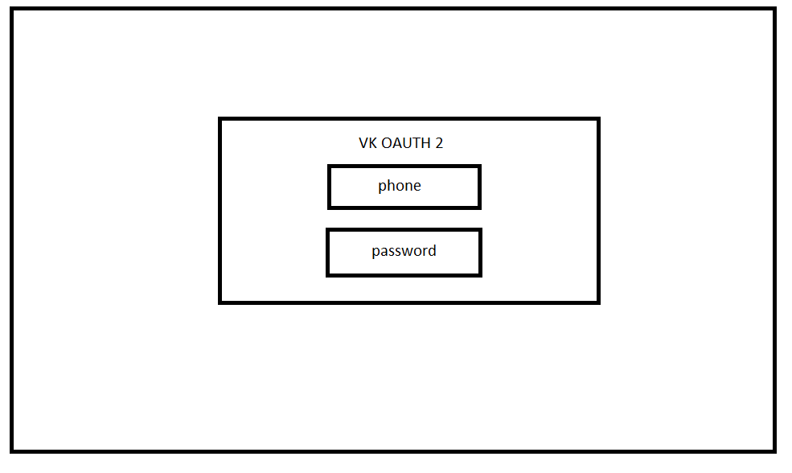
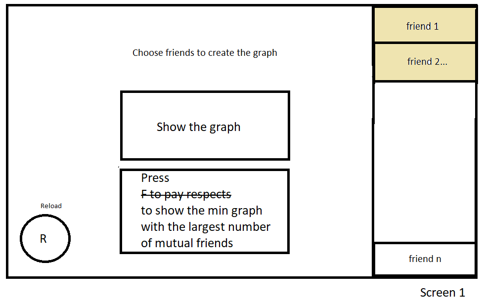
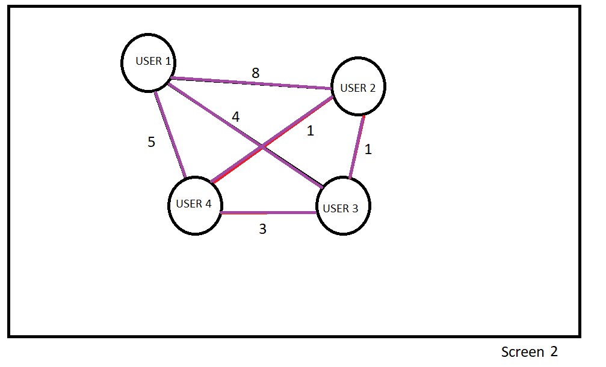
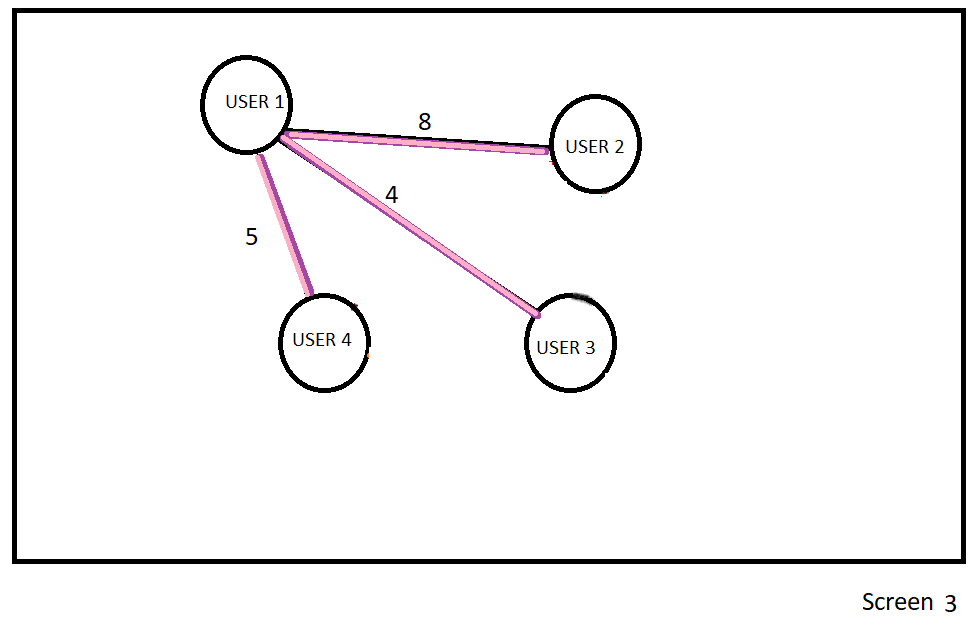

# VkFriendsGraph_1xor1
# Спецификация
### Постановка задачи:
Визуализация графа общих друзей из социальной сети vk.com для заданного пользователем списка участников социальной сети. Вершины графа должны однозначно идентифицировать пользователя социальной сети. У рёбер видно свойство - количество общих друзей. Нажатие на кнопку визуализирует минимальный подграф, объединяющий всех пользователей по рёбрам с наибольшим количеством общих друзей.

### Решение задачи:
Для решения задачи выбран алгоритм поиска минимального (в нашем случае максимального) остовного дерева - алгоритм Краскала
В качестве входных данных будут идентификаторы пользователей из vk.com и количество общих друзей между ними
 
В результате работы алгоритма будет выводиться граф, в вершинах которого пользователи социальной сети, а на ребрах - количество общих друзей
 
Из структур данных планируется использовать ArrayList, Hashmap

# Примерный вариант GUI:

| step 1      | step 2      | 
|------------|-------------| 
|  |   |

| step 3      | step 4      | 
|------------|-------------| 
|  |   |

На шаге 1 выполняется oauth 2 авторизация на сайт vk.com
 
На шаге 2 у авторизованного пользователя появляется список друзей, которых можно выбрать для построения графа
 
На шаге 3 строится граф общих друзей из выбранного пользователем списка
 
На шаге 4 по нажатию кнопки строится максимальное остовное дерево из этого графа

# План разработки
Первая итерация: 
1. Выбор необходимого алгоритма
2. Реализация алгоритма
3. Написание запросов к api
4. Написание юнит-тестов 

Вторая итерация:
 
5. Реализация графического интерфейса
 
6. Написание отчета

# Роли в команде:
Александров Руслан - разработчик
 
Рудоман Вадим - разработчик
 
Ханова Юлия - разработчик, капитан
